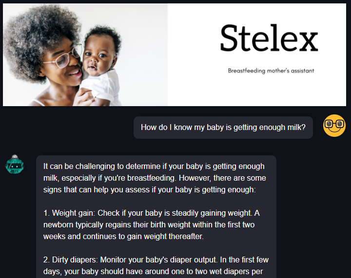

<p  align="center">


</p>  


I built a chatbot named **"Stelex"**. It answers questions that breastfeeding mothers(especially in Africa) might have. It utilizes AI technology to understand the user's input in both speech and text to give a response to the user. The user can decide to ask their questions verbally or type it.

<p  align="center">



</p>  

## Development: 

### Tech Stack
1. Tensorflow: Model building and development
2. Pinecone: Vector database for storing embeddings.
3. Microsoft Azure: deployment and API


## Features
- Utilizes the Langachain and chatbot APIs to power the chatbot functionality.
- Makes use of Microsoft Azure speech API to convert speech-to-text
- Integration with Pinecone for efficient storage and retrieval of chatbot responses.
- Built with Streamlit, providing a user-friendly web interface for seamless interaction.
- Handles a wide range of questions and concerns related to breastfeeding.

## Prerequisites
Before running the breast_feedGPT application, ensure you have the following dependencies installed:

- Python 3.7 or above
- Azure Speech API credentials
- chatgpt API credentials
- Pinecone API credentials

## Installation

1. Clone the repository:

```
git clone https://github.com/hope205/Stelex.git

```
2. Navigate to the project directory:

```
cd Stelex
```
3. Install the required dependencies:

```
pip install -r requirements.txt
```
4. Set up the necessary API credentials by following the instructions in the .env.example file. Rename the file to .env and populate the required fields with your own credentials.

## Usage

5. Start the web interface:

```
streamlit run app.py
```

6. Open your web browser and access the application at http://localhost:8501
7. Ask questions related to breastfeeding in the provided input field and receive responses from the chatbot.
8. Explore different features and functionalities offered by the breast_feedGPT application through the web interface. 
9. 
